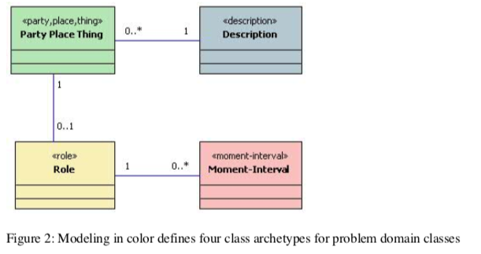

# Object Modeling

## The Basics

### Archetypes

* the event archetype (aka Moment-Interval); red
  * a moment of time or an interval of time
  * one needs to work with or track for business or legal reasons
  * examples are sale, rental
* the role archetype; yellow  
  * way of participation by a PPT
  * examples are owner, customer
* the "catalog-entry like description" archetype; blue
  * a collection of values that apply again and again
  * example vehicle (thing) vs. vehicle (description)
* the "party, place or thing" archetype (PPT); green
  * someone or something that plays a role
  * examples are organization, location, product

  

## References

* Nicholas' introductory talk [Modeling on the Right Side of the Brain](http://blog.firsthand.ca/2014/04/modeling-on-right-side-of-brain.html)
* Stephen. R. Palmer's Online Documentation \([Online](http://www.step-10.com/SoftwareDesign/ModellingInColour/index.html) \| [PDF Format](https://www.dropbox.com/s/oc3g9a6hipecp8j/Peter%20Coad%27s%20Modeling%20in%20Color.pdf?dl=0)\)
* The book [Java Modeling In Color With UML: Enterprise Components and Process](http://www.amazon.com/Java-Modeling-Color-UML-Enterprise/dp/013011510X/ref=sr_1_1?ie=UTF8&qid=1447701102&sr=8-1&keywords=modeling+in+colour) - however Palmer's online document is sufficient.
