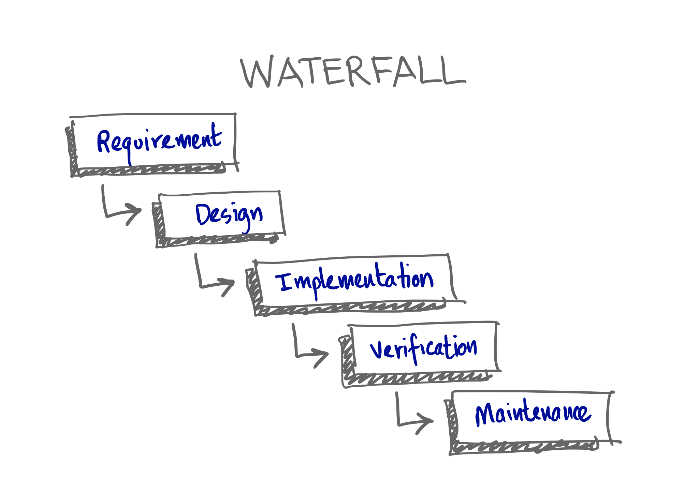
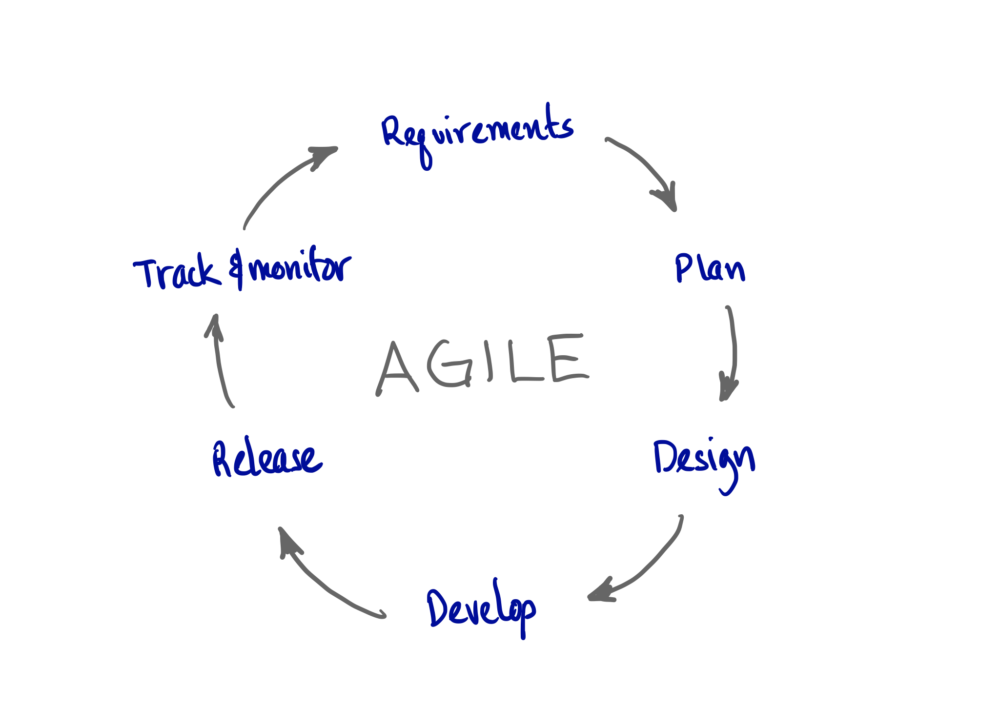
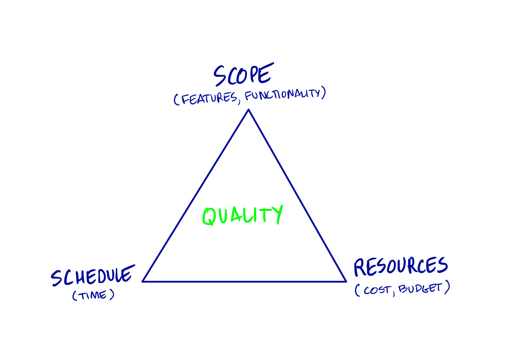
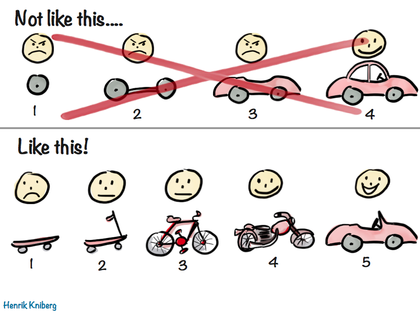

# stakeholder-presentation-en

build-lists: true autoscale: true theme: Sketchnote

## Stakeholder Onboarding

## Agenda

* The nature of software development
* Risks in developing software
* Practices we embrace

## History

* In the past, software development teams were using the Waterfall methodology
* In the 90s, Agile movement introduced lightweight methodologies

## Waterfall methodology is wrong

* Suited for well-planned processes \(i.e. manufacturing\)
* Not suited for empirical process \(i.e. new product development\)

> The empirical model of process control provides and exercises control through frequent inspection and adaptation for processes that are imperfectly defined and generate unpredictable and unrepeatable outputs. -- Wikipedia

> Software creation is an empirical activity

## Effects on Software Creation

* Cannot define a 100% accurate specification upfront
* Cannot reliably estimate effort and cost
* Impossible to accurately schedule
* Requires creative adaptation

## Risks in software development

## Top 3 Risks in software development

1. Going over budget
2. Late delivery
3. Not meeting requirements/expectations
   * features
   * performance
   * reliability
   * durability

## Practices we embrace

* Dedicated Product Owner
* Iterative approach
* Feedback early and often
* Executable specifications
* Open source

^ Dedicated Product Owner: helps meeting the requirements Iterative Approach: helps meeting the requirements, on-time and within budget Feedback early and often: helps meeting the requirements within budget Executable specifications: helps meeting the requirements and save time when adding new features Open Source: helps with budget

## Minimum Viable Product

* Value is delivered at each stage of development
* Solution is delivered and improved upon in an iterative model
* At each stage, the solution can be evaluated and adjusted if needed

## Minimum Viable Product

## Example

* Client database in read-only, updates through Excel
* Portfolios in read-only, updates through Excel
* Client updates in new system
* Portfolios updates in new system

## Other practices we embrace

Ubiquitous Language • Continuous Investment • Peer Reviews • Pair Programming • Event Storming • Domain Modeling • Discovery • Story Mapping • Specification by Examples

## Conclusion

With agile practices:

* You are in control of the requirements, budget and time
* Early feedback produces higher quality
* We minimize the risks
* You can benefit early

